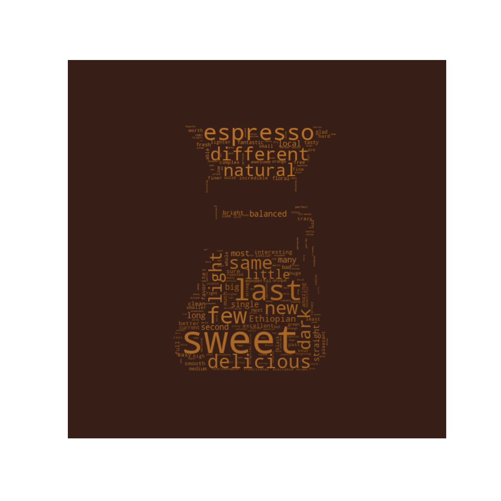

# About
While under quarantine, my coffee bean stash began to run low. Without a grocery store to turn to, I began a great online search to find the best bag of online coffee that I could get shipped to my house. This repo contains the results of my journey: code to scrape and analyze 1090 comments from a thread about exceptional coffee on [home-barista.com](https://www.home-barista.com/coffees/what-is-wow-ing-you-t22185.html).

# Steps
+ Scrape posts and write to text files
+ Analyze text using [spacy](https://spacy.io/) to get company names and descriptive adjectives
+ Generate word cloud of adjectives home-barista.com members use to describe their coffee
+ Use Google to associate companies with their websites, and a count of how many times they were mentioned.

